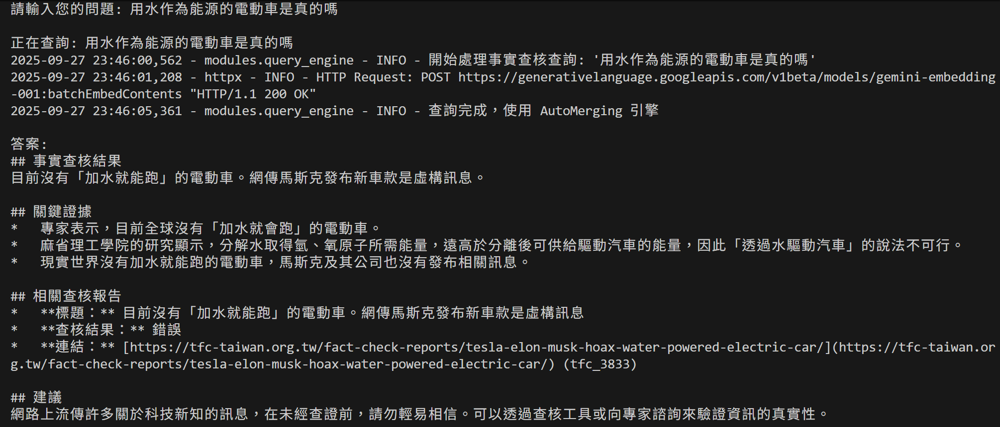
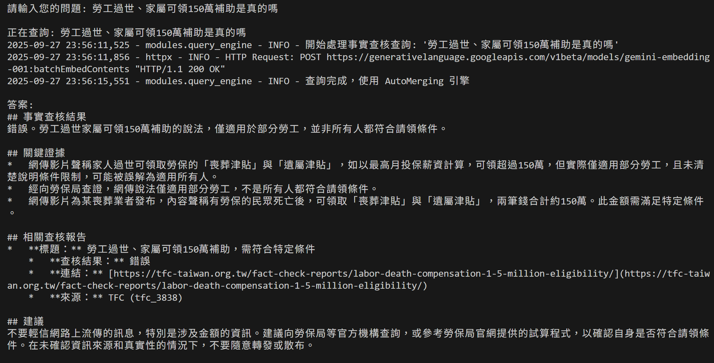
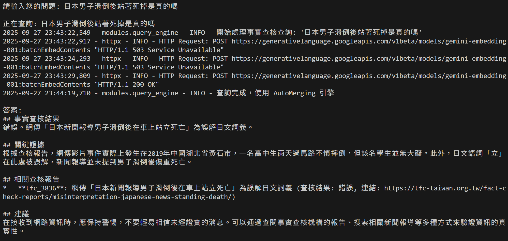
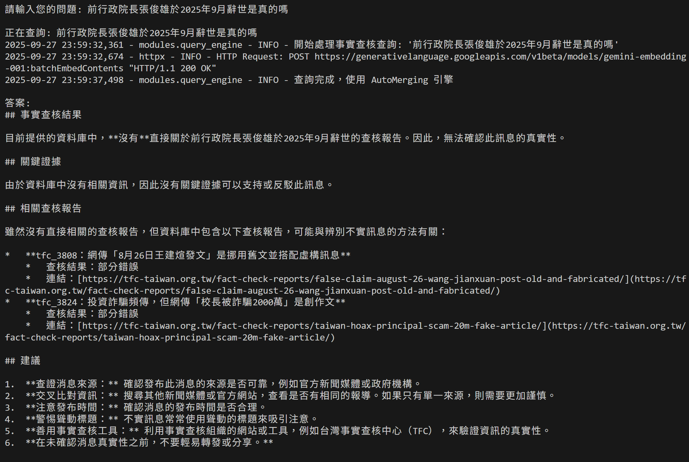

# Fact-Checker 

這個專案整合兩個主要部分：

1. `factchecker_crawlers/`：Scrapy 爬蟲，用來抓取台灣事實查核中心（TFC）的查核報告並輸出 JSON 檔案。
2. `rag_system/`：基於 LlamaIndex、Google GenAI（Gemini）與 ChromaDB 的 RAG（檢索增強生成）系統，用以對抓取到的查核報告進行向量化、索引與查詢。

## 專案資料夾
- `factchecker_crawlers/`：爬蟲程式、設定與輸出（`output/tfc_reports_sorted.json` 為 RAG 系統預期輸入）。
- `rag_system/`：data_processor、embedding、vector_index、retriever、query_engine 等模組，以及 `main.py`（執行入口）。

## 實例
### 範例一

### 範例二

### 範例三

### 範例四（不存在於資料庫的訊息）

## TODO
- 調整 embedding ：目前向量化時很容易會觸發 Google GenAI 回傳 503（Service Unavailable），導致後面的資料都無法向量畫到，目前看起來是沒有超過官方文檔的速率，需再找找看原因。
- 新增資料來源：考慮把 MyGoPen、Cofacts 等社群/事實查核來源納入 RAG 的資料庫中。
